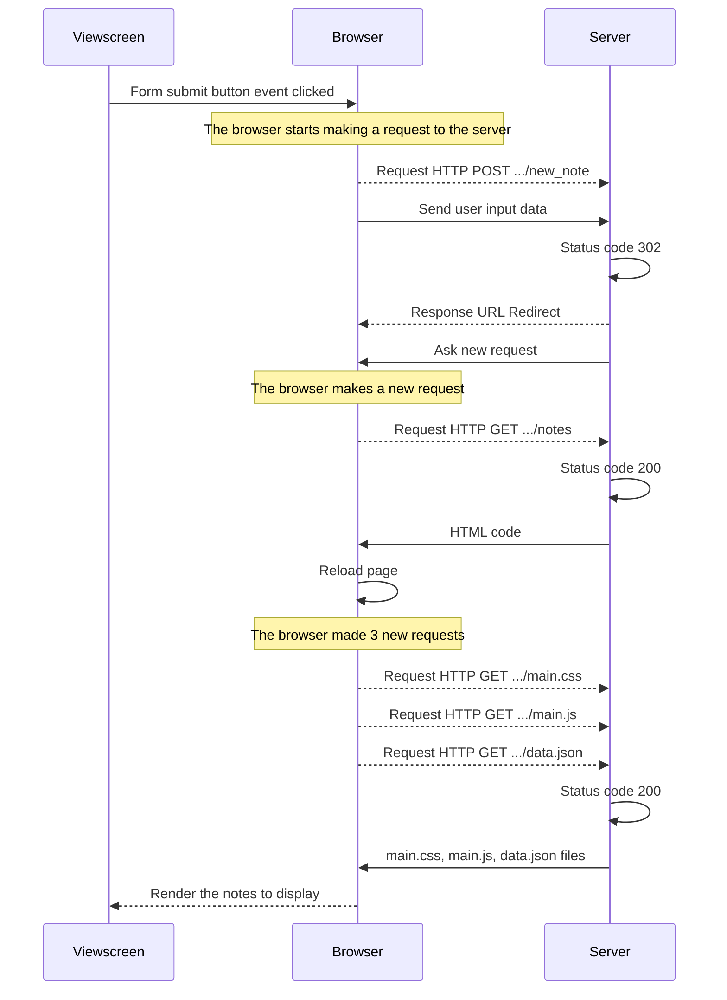
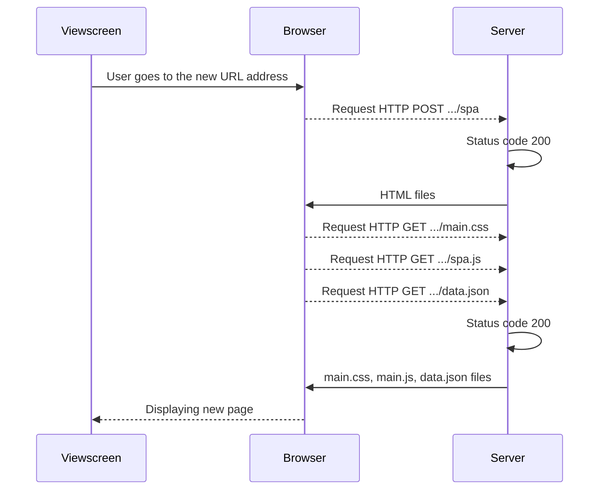

## Exercise 0.4: New note



## Exercise 0.5: Single page app



## Exercise 0.6: New note

```mermaid
sequenceDiagram
    participant Viewscreen
    participant Browser
    participant Server
    Viewscreen->>Browser: Submit button triggered
    Note over Browser: The browser starts executing code in 'spa.js' which<br> contains a few instructions to:<br> <br> 1. Fetch the form-element page<br> 2. Register an event handler to handle form submission<br> 3. Calls the method that prevents new GET requests to the server
    Browser-->>Server: Request HTTP POST .../new_note_spa
    Browser->>Server: Send new note as JSON string
    Browser->>Viewscreen: Rerenders the note list
    Server->>Server: Data parsed
    
